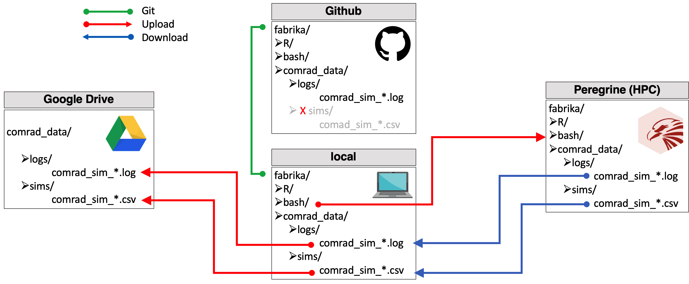

  
```{r, include = FALSE}
knitr::opts_chunk$set(
collapse = TRUE,
comment = "#>"
)
```

```{r pipe, include=FALSE}
library(magrittr)
library(fabrika)
```


## Project structure

`fabrika` relies on a strict folder structure



### Absolute paths

On Peregrine: `/data/p282688/fabrika`
On my local compute: `~/Github/fabrika`

### Workflow

1. Run simulation on Peregrine. Call `run_comrad_sim_hpc()` from a local R instance to sbatch `run_comrad_sim.bash` on Peregrine.

```{r run_sim, eval=FALSE}
fabrika::run_comrad_sim_hpc(
  nb_gens = 100,
  nb_replicates = 5
)
```
```
Submitted batch job 13409658
Submitted batch job 13409659
Submitted batch job 13409660
>
```

2. Capture job IDs from console output. This will be your key to easily refer to and access the submitted jobs.

```{r catch_job_ids}
job_ids <- fabrika::job_ids_from_string(
"Submitted batch job 13409658
Submitted batch job 13409659
Submitted batch job 13409660"
)
job_ids 
```

Other options include catching the jobs directly upon call, with `catch_job_ids()`, or finding the keys from the logbook (see step 4), using the batch ID or a single job ID.

3. Track the job status
```{r jobs_info}
# Submission queue on the HPC
queue()

# Call jobinfo on the HPC
job_ids[1] %>% job_info()
# Or shorter to catch only status
job_ids %>% job_status()
```

4. When the jobs have completed, or failed, download the logbook and update the mising entries

```{r logbook, eval=FALSE}
# Download and access logbook
download_logbook_hpc()
logbook <- read_logbook()
head(logbook)

job_ids %>% complete_logbook_entries() # complete entries for "status" and "runtime"
logbook <- read_logbook()
head(logbook)
```

5. Download data files from HPC, upload to Google Drive
```{r data_files, eval=FALSE}

# Download from HPC
download_sim_csv_hpc(job_ids = job_ids)
download_sim_log_hpc(job_ids = job_ids)

# Upload to Google Drive
upload_sim_csv_drive(job_ids = job_ids)
upload_sim_log_drive(job_ids = job_ids)
update_logbook_drive()
```
And don't forget to git commit & push, from RStudio or terminal.

